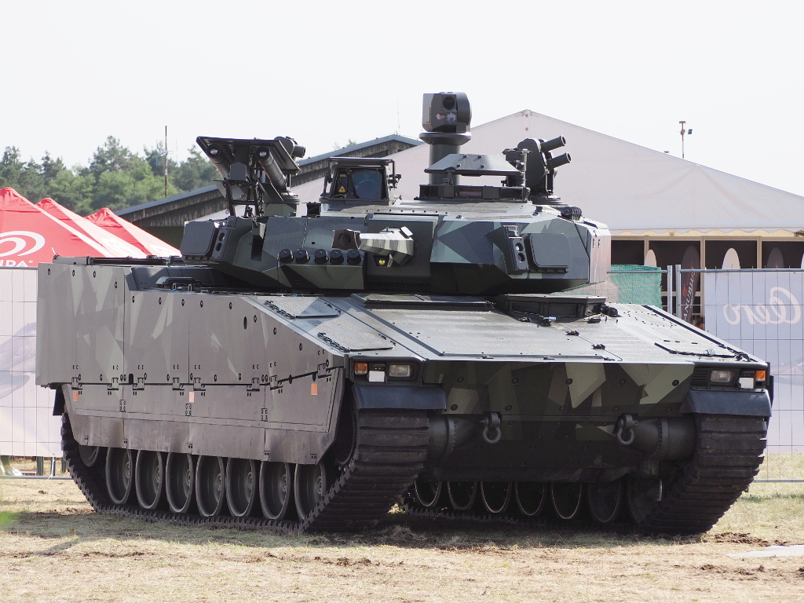
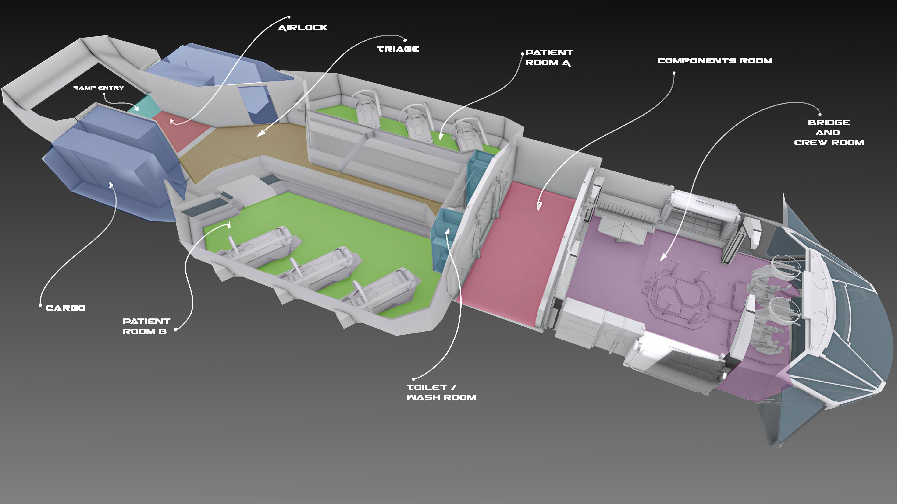
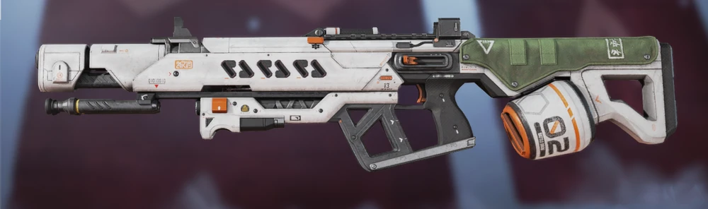

Militaries
==========

United Systems Frontier
-----------------------

Weapons
~~~~~~~

Mostly directly ripped from Titanfall and Apex, the weapons there mostly make sense. Sans-titans, it give is a much more infantry fighting feel, which I really want to convey, not the (admittedly awesome) insanity that is massive robots beating the shit out of each other. They do exist in the universe, but aren't really feasible on the initial planet, and the production/maintenance facilities would be a complete waste on a place like Omuen 6.

Vehicles
~~~~~~~~

I did, however, want some kind of vehicles to exist, but mostly as defensive vehicles, so infantry fighting vehicles (specifically the CV90s), with a futuristic flavor to them. Something like the below but *much* smoother, lighter (probably ~20t), etc. It's a multi-purpose vehicle, used for exploration with the frontier module and for defense against native flora and fauna if required. While those encounters are rare, it has been keep for it's rugged survivability and use as an emergency shelter in harsh conditions.

A single chassis with a lot of common parts is something needed out in the frontier, where replacement parts are important but may take significant time to print. This is true for both ground and air/space vehicles.

The 36mm variant can punch holes in almost everything using the assisted sabot rounds, and also fires a slower multi-purpose round with a small HEAT charge and an airburst fragmentation mode. The 25mm only has the HEAT and frag rounds, but fires them at a faster velocity than the 36mm. There is also a 103mm that is basically a light tank. This one only has emergency space for non-crew members, so it's not used on expeditions much, but usually sits in the base for defense. It also doesn't have the same endurance, as it's a defensive weapon.

Adding some 'stats' below.

.. include:: ./includes/cv-8.rst

Air Power
~~~~~~~~~

Space travel is a thing, but interstellar travel still requires large ships, and those aren't really needed in the frontier. Supply ships come in and drop off what they would need from interstellar travel. Ships that can go to orbit and go to other planets are available, but they're mostly supply and survey ships, not military ships or anything.

Even the surface ships are mostly for the survey stuff, and a little bit of military support aircraft for the defense force. Even these are mostly used for survey and rescue stuff, the latter having a special branch in the base.

For this I honestly thought of stuff like Star Citizen, at least for the aircraft. While they're built to be spaceships, I think they just look good as surface vessels. Something like the Apollo just scream air-breathing ships to me, not really space flight.

Taking the Apollo and replacing most of the glass with stuff like Cyberpunk 2077's `Crystal Dome`_ display stuff, because glass doesn't really make much sense in the future. Still some heavy-duty stuff on the rear compartment, and some changes to the layout, it would have 3 variants: cargo, medevac and light air support. The machinery is usually compact or build-able, so the flatter profile is okay. Obviously not able to move interstellar, it would still have full accommodations for longer inter-planetary travel. The whole front section is designed for use with any orientation for use under thrust.

Exterior design-wise, the design will be relatively similar, but without all the weird gaps and stuff. More in line with a modern stealth craft, it will have no gap between the nacelles and the body, the double-decker area is not really useful and will merge into a single layer, air-breathing intakes will be simplified and diverted through the body for stealth. The front glass will all be replaced with the same composite as the rest of the ship, with a full sensor suite able to give a floating `Crystal Dome`_-like interior. There is a second weapon turret below on the military version for ground attack and gunship support.

The engines can rotate and shift for vertical lift, enabling just two engines to balance the ship.

The base probably has ~50 Apollo-like craft. The single airframe lowers maintenance and parts printing costs significantly.

* 30 cargo - S-23

  * Similar interior but with all stuff behind components room replaced with cargo space
  * Used for bringing supplies between outposts and from space to ground
  * Orange color scheme

* 10 exploration - SX-23

  * One patient room replaced with sensor suites
  * detailed scanning arrays
  * Blue color scheme

* 5 medevac - SM-23

  * 6 medical beds each
  * significant medical supplies
  * Includes a medium printer for Simulacra
  * short range plasma cutter beam weapon for rescue operations
  * Medical beds can be rotated and angled for space flight thrust

* 10 military light-attack - AS-23

  * Transport focused. Can fit a whole CV-8 in the bay
  * With the CV-8 it can hold 16 more troops in the sides
  * Without the CV-8 32 troops can fit
  * Bridge and crew room has medical supplies and a single triage bed
  * Upper turret same 36mm turret as the CV-8
    (has a folding cover for stealth)
  * Also has deployable lower turret with combined 103mm and 25mm cannon for
    ground support (normally stowed for flight)
  * Air-to-surface missiles in internal bays
  * Air-to-air and space-to-space missiles on engine nacelle internal bays

.. image:: ../_static/images/examples/ships/Apollo_Triage_Concept.png
  :width: 49%

Guns
~~~~

Again, these are mostly based around things from TF and Apex, with a more limited load available. I'm a huge fan of bullpup firearms, and with size/weight being a relatively important concern for a space-faring group, they should all be as small as possible while also meeting the requirements.

The standard rifle is used in different variants for multiple tasks. Parts similarities mean that having a bunch of custom weapons floating around is not really viable from a longevity standpoint. Something along the lines of the Rampage_ crossed with the R-301_ is what I'm thinking, a bullpup design with a compact area around the barrel. The barrel and upper could be replaced to suit different roles, with the same lower as they would all use the same ammunition, similar to an AR-15. This would give it modularity and standardization. Optical sights are standard on all of them, with added full-integration digital sights for Simulacra.

Heavy weapons include a short range cutting beam that's mostly used for search and rescue. Mostly it's guided munitions from a rocket launcher.

* Standard rifle: Almost all troops carry some version.
* Precision rifle: a more accurate and longer version of the standard rifle
* Light rifle: Even shorter standard rifle, used by evac, mounted troops and pilots.
* Heavy rifle: Replaceable barrel version of the standard rifle. More akin to the RPK or IAR in comparison.
* Pistol: I'm an absolute sucker for the new Laugo Alien. It's just that.
  The alien is futuristic enough as it is.
* Heavy ordinance

  * Long-range anti-armor: Javelin-like system for launching large anti-tank and anti-air rockets. Multi-purpose. See ARMA's Titan launcher but without the weird differentiation between AT and AA.
  * Energy cutter: line-of-sight beam weapon, used for rescue but can be used for anti-armor in a pinch.
  * Man-portable mortars
  * Emplaced weapons
  * Grenade launchers: coilgun-like launching systems for grenades and other ordinance. Guided anti-armor grenades as well as anti-personnel grenades are used.

The force on the base isn't some specialist force, but it does fill all the roles needed for base defense and SaR.

.. Links

.. _`Crystal Dome`: https://cyberpunk.fandom.com/wiki/CrystalDome
.. _Rampage: https://apexlegends.fandom.com/wiki/Rampage_LMG
.. _R-301: https://apexlegends.fandom.com/wiki/R-301_Carbine