Sources for Images
==================

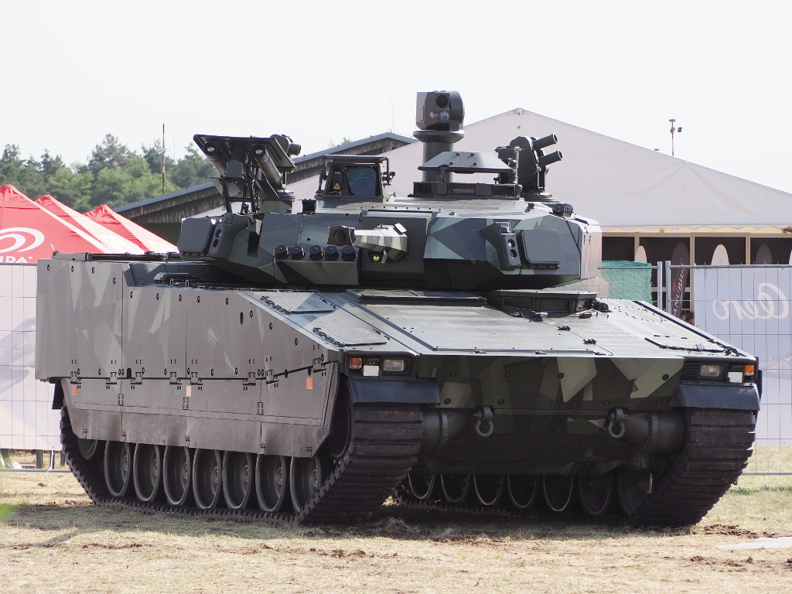

https://en.wikipedia.org/wiki/Combat_Vehicle_90#/media/File:CV_90_Mk_IV_SIAF-2022.jpg

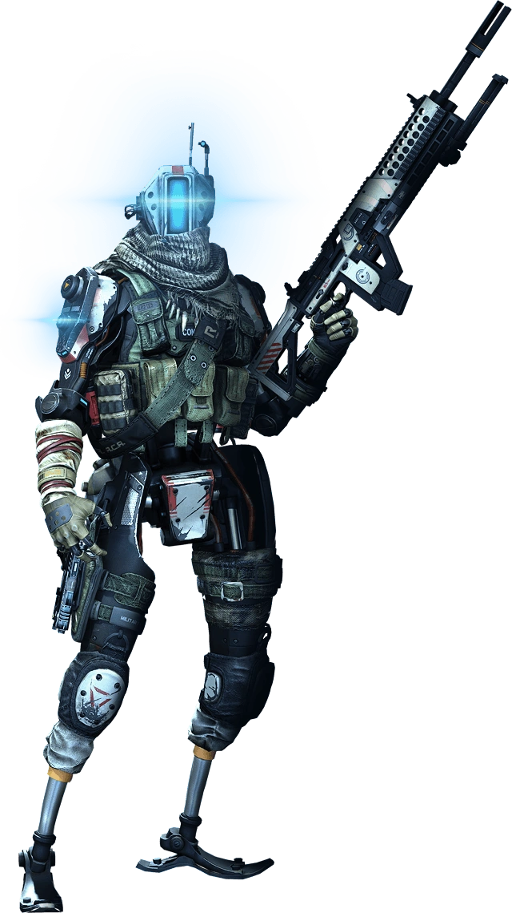

https://titanfall.fandom.com/wiki/Grapple?file=Grapple_pilot.png

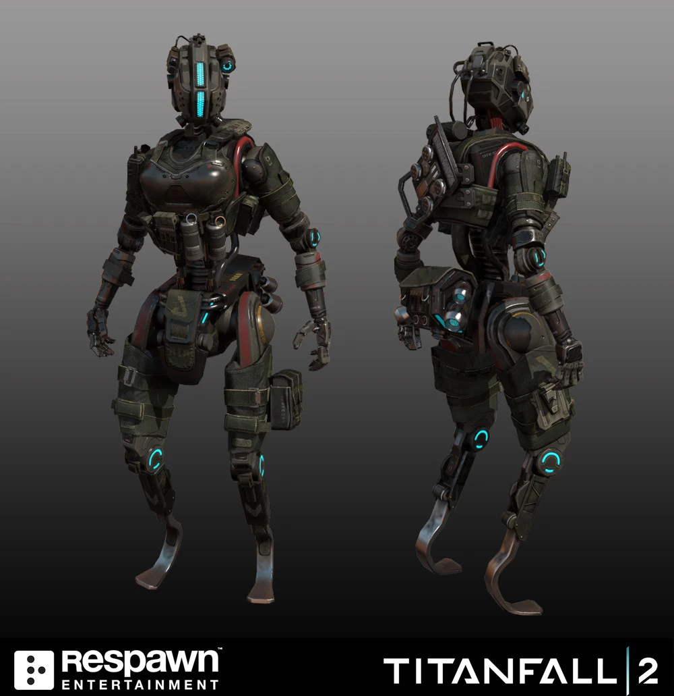

https://titanfall.fandom.com/wiki/Simulacrum?file=Stim_2.jpg

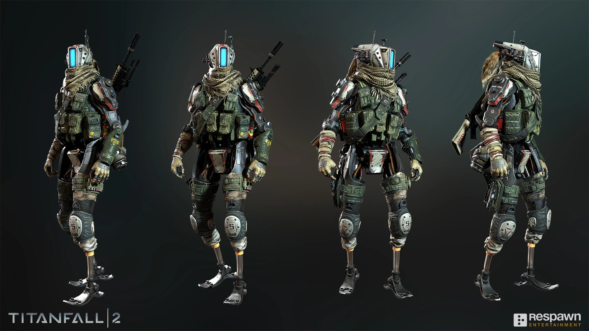
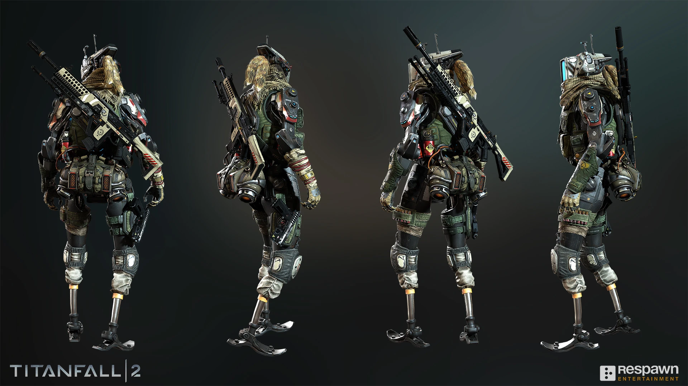

https://titanfall.fandom.com/wiki/Phase_Shift

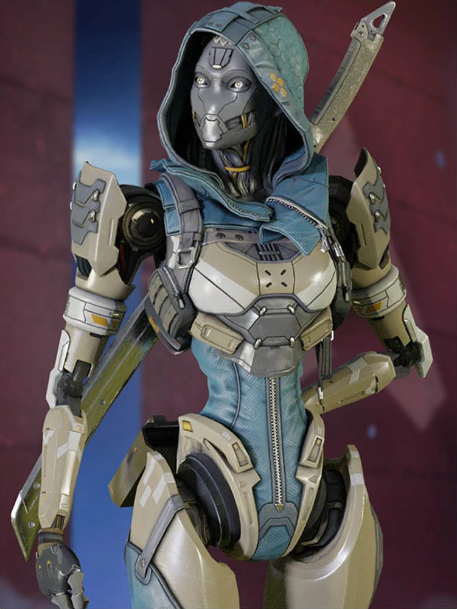

https://twitter.com/AmandaDoiron11/status/1456727348808601603

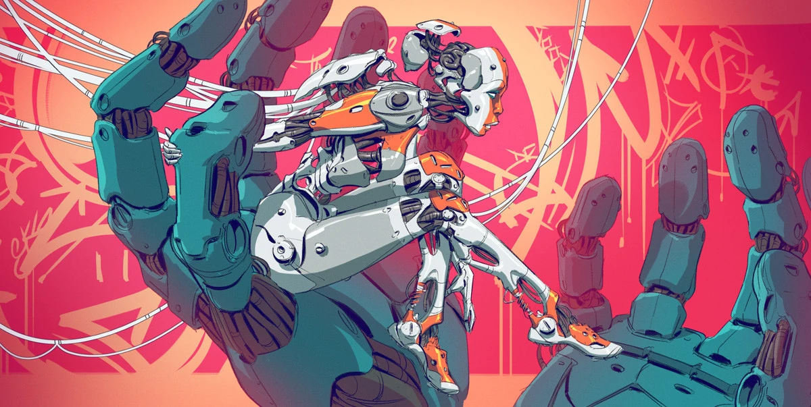

https://titanfall.fandom.com/wiki/Simulacrum?file=Hands_of_the_Machine_Hi.jpg

.. Apollo medevac
.. image:: ../_images/examples/ships/Apollo_Triage_Concept.png
  :width: 49%
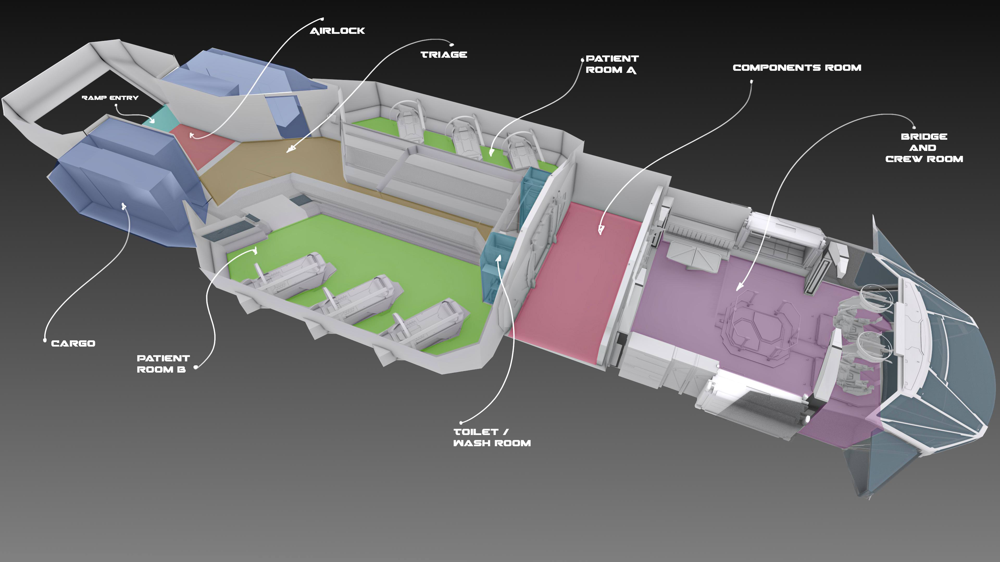

https://starcitizen.tools/Apollo_Medivac

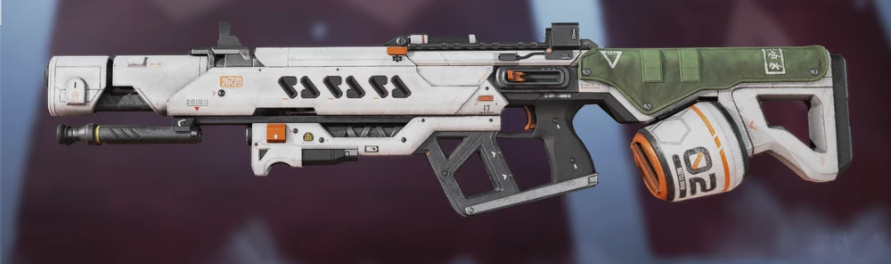

https://apexlegends.fandom.com/wiki/Rampage_LMG

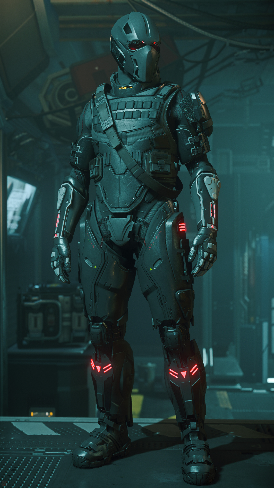

https://starcitizen.tools/File:DustUp_Tactical_armor_set.jpg

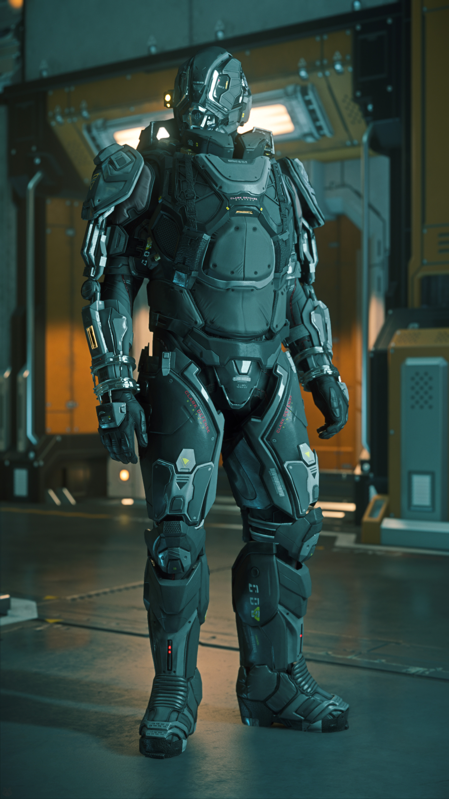

https://starcitizen.tools/File:Defiance_Tactical_armor_set.jpg

.. image:: ../_images/examples/personnel/CSP-68M_Backpack.png
  :width: 49%

https://starcitizen.tools/File:CSP-68M_Backpack.png