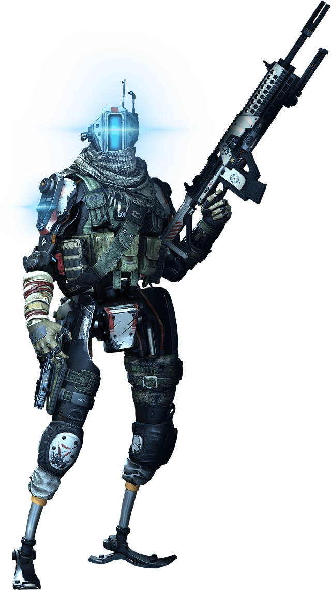
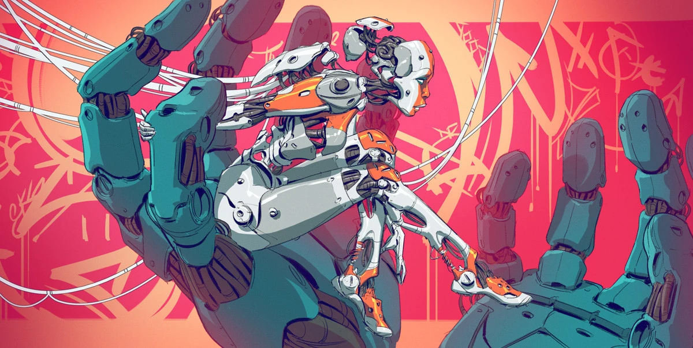

Sources for Images
==================

.. image:: ../_static/images/examples/IFV_Example_CV_90_Mk_IV.jpg

Used from `CV90 Wikipedia Page <https://en.wikipedia.org/wiki/Combat_Vehicle_90#/media/File:CV_90_Mk_IV_SIAF-2022.jpg>`_

https://titanfall.fandom.com/wiki/Grapple?file=Grapple_pilot.png

https://titanfall.fandom.com/wiki/Simulacrum?file=Stim_2.jpg

https://titanfall.fandom.com/wiki/Phase_Shift?file=Phase_Shift_2.jpg

https://titanfall.fandom.com/wiki/Phase_Shift?file=Phase_Shift_3.jpg

https://twitter.com/AmandaDoiron11/status/1456727348808601603

https://titanfall.fandom.com/wiki/Simulacrum?file=Hands_of_the_Machine_Hi.jpg

.. Apollo medevac
.. image:: ../_static/images/examples/ships/Apollo_Triage_Concept.png
.. image:: ../_static/images/examples/ships/Apollo_-_interior_layout.jpg

https://starcitizen.tools/Apollo_Medivac