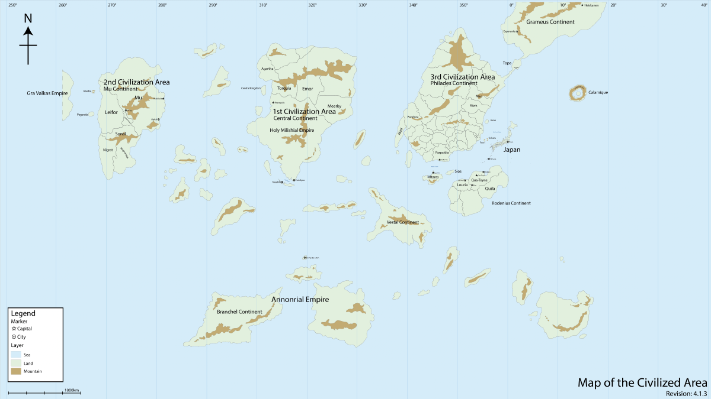

.. Summoning Frontier documentation master file, created by
   sphinx-quickstart on Fri Jun 30 12:12:26 2023.
   You can adapt this file completely to your liking, but it should at least
   contain the root `toctree` directive.

====================
 Summoning Frontier
====================

.. toctree::
   :maxdepth: 2
   :caption: Contents:
   :glob:

   Book/*

   Ideas/index

Source: https://gitlab.com/kaictl/writing/summoning

.. note::
  This map will be updated with something more resembling the world I'm thinking
  of, not the 'default' Summoning Japan world.

`Map source <https://nihonkoku-shoukan.fandom.com/wiki/New_World#Gallery>`_

`Book source <https://gitlab.com/kaictl/writing/summoning>`_

Inspired by `Japan Summons/Nihonkoku Shoukan by みのろう`_

.. _`Japan Summons/Nihonkoku Shoukan by みのろう`: http://mokotyama.sblo.jp/

